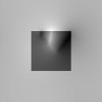
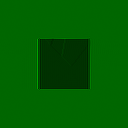

# Specimen Generator

Generate specimens manually using 3D modelling, or procedurally generate random specimens.

Currently working in Blender 2.78a. It should work with newer versions of Blender, but usage of the ray_cast() algorithm changed at some point, so this will not work with earlier versions without altering a line in PointsInsideMesh(). For such versions, change `result, location, normal, index = ob.ray_cast(orig, axis * 10000.0)` to `location,normal,index = ob.ray_cast(orig,axis*10000.0)`.

## `random.py`

Procedurally generates specimen simulations. Requires Blender to run. Open file inside Blender, set output_path, and run. It might be possible to run this outside Blender, but I haven't tried it. Blender is free and easy to install, and contains all required packages. Output format is a text file with each block of rows/columns representing a 2D slice of the binary specimen mask. Each block is separated by an empty line. 

This produces specimen files that are compatible with [phase-ret-dl](https://github.com/zac-k/phase-ret-dl), which uses these files to simulate electron micrographs and train a neural network.

## `vecfield.py`

Generate a binary specimen mask file, and a file for each of the three components of the magnetisation.

I suggest to use the included `example.blend` to begin with. Note that this file also contains the script, which should work, but might be out-of-date compared to the one directly in this repository.

The vector field is produced based on what is selected, and the mask is produced by object name:
* Open the `.blend` file in Blender. 
* Set the desired output path. 
* Select all vector objects. 
* Ensure that the name of the specimen object is consistent with that in the script. 
* Run.

### Example

I've included an example of some simulations using `vecfield.py` and the included `example.blend` file. Note that my repository [phaseimaging](https://github.com/zac-k/phaseimaging) provides a lot of the functionality to do these simulations, but the non-uniform magnetisation used here is not implemented in that library as of writing this README. 

#### Included 3D model

This is a render of the model, showing the carbon support film, a square particle, and arrows describing the local magnetisation direction. A nearest neighbour method is used to determine the magnetisation at each voxel in the specimen. Note that the carbon film is not used in the following example.

#### Total projected phase

This is the projected phase of the specimen, using a mean inner potential and magnetisation to simulate magnetite.

#### Under-, in-, and over-focus micrographs

In and out of focus micrographs simulated by transferring the wavefield described by the exit phase above. An imaginary component is used for attenuation. 

#### Magnetic component of the retrieved phase

The magnetic component of the phase, retrieved from the above three micrographs, and a corresponding set with the specimen flipped.

## `scalar.py`

Generate a binary specimen mask for use in simulating refracting or uniformly magnetised objects.

* Open script inside Blender.
* Set the output path.
* Create or import an object. 
* Select the object.
* Run the script.

Note that the created array will be in the region `(-5,5)` in each direction. You can use the carbon film object in `example.blend` as a guide for where to place your specimen object.